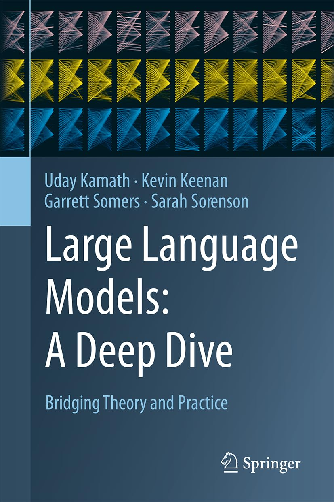

# Large Language Models: A Deep Dive

This repository contains expanded tutorials and python notebooks to accompany the textbook Large Language Models: A Deep Dive, by Kamath, Keenan, Somers, and Sorenson.

 

## About this repository

Within the eight chapter folders, you will find nine total tutorials (chapter 3 has two separate tutorials) displayed in markdown format, accompanied by a Python notebook that runs through the calculations. The tutorials are expanded versions of the tutorials that appear at the end of chapters 2-9 in the published book. These tutorials are designed to provide the most value if you follow these steps.

1. Read the chapter in the book.

2. Look at the markdown tutorial and open the notebook in Google Colab. They are designed to compliment each other, with the notebook containing all the details of the calculations and the tutorial providing a more narrative description of the details. 

3. Read through the markdown text while running the corresponding cells in the tutorial.

4. Alter, adapt, and expand upon the notebooks for your particular use-cases.

## How to use the notebooks

Notebooks can be run on local GPU resources or through booting a Google Colab instance on the imported notebook. 

Because our tutorials were designed to run on these ephemeral Colab instances, they are self-contained and do not a separate `requirements.txt` pip file for dependencies -- necessary installations and downloads are completed at the top of each notebook. 

The tuturials were tested and run in Python 3.10. Where appropriate, we have hard-coded package versions to avoid incompatability issues. 

## Prerequisites

You will need API tokens from three different websites in order to smoothly run every tutorial notebook.  To smooth the process, here is a list of accounts that will be needed to run each of the notebooks.

0. [Google Colab](https://colab.research.google.com/)

    * The tutorials are designed to run on Colab, which gives access to GPU resources, but can be adapted to other environments.
    * Free and trial versions offer limited GPU access, while a premium subscription allows for much greater GPU use. 

1. [OpenAI API](https://platform.openai.com/)

    * Create a free OpenAI API account, navigate to https://platform.openai.com/, and create an API key.
    * Tutorials for chapters 4 and 7 make calls to variants of the gpt-3.5 and gpt-4 models, which will cost in total a few dollars. The API key is entered within these notebooks. 

2. [Kaggle](https://www.kaggle.com/)

    * Kaggle hosts a repository of datasets, some of which we use for experiments. 
    * Create a free Kaggle account, go to settings, and create an API token. 
    * This generates a `kaggle.json` file, which can be uploaded to the working directory in Google Colab instances.

3. [Hugging Face](https://huggingface.co/)

    * Hugging Face hosts numerous language models and maintains code that can be used to download, customize, and operate langauge models.
    * Create a free Hugging Face account, go to settings, and create an access token. This token is passed within the notebooks, and is needed for accessing gated models. 

4. [Llama-2](https://huggingface.co/meta-llama/Llama-2-7b-hf)

    * Llama-2 is a family of large language models that we reference and use throughout the book. 
    * At publication time, access is gated and requires completing a disclosure. You can acccess the discloure at https://huggingface.co/meta-llama/Llama-2-7b-hf, after which you will be able to download the models using Hugging Face tools. 

## About the book

Large Language Models (LLMs) have emerged as a cornerstone technology, transforming how we interact with information and redefining the boundaries of artificial intelligence. LLMs offer an unprecedented ability to understand, generate, and interact with human language in an intuitive and insightful manner, leading to transformative applications across domains like content creation, chatbots, search engines, and research tools. While fascinating, the complex workings of LLMs―their intricate architecture, underlying algorithms, and ethical considerations―require thorough exploration, creating a need for a comprehensive book on this subject.

This book provides an authoritative exploration of the design, training, evolution, and application of LLMs. It begins with an overview of pre-trained language models and Transformer architectures, laying the groundwork for understanding prompt-based learning techniques. Next, it dives into methods for fine-tuning LLMs, integrating reinforcement learning for value alignment, and the convergence of LLMs with computer vision, robotics, and speech processing. The book strongly emphasizes practical applications, detailing real-world use cases such as conversational chatbots, retrieval-augmented generation (RAG), and code generation. These examples are carefully chosen to illustrate the diverse and impactful ways LLMs are being applied in various industries and scenarios.

Readers will gain insights into operationalizing and deploying LLMs, from implementing modern tools and libraries to addressing challenges like bias and ethical implications. The book also introduces the cutting-edge realm of multimodal LLMs that can process audio, images, video, and robotic inputs. With hands-on tutorials for applying LLMs to natural language tasks, this thorough guide equips readers with both theoretical knowledge and practical skills for leveraging the full potential of large language models.

This comprehensive resource is appropriate for a wide audience: students, researchers and academics in AI or NLP, practicing data scientists, and anyone looking to grasp the essence and intricacies of LLMs.

Key Features:

* Over 100 techniques and state-of-the-art methods, including pre-training, prompt-based tuning, instruction tuning, parameter-efficient and compute-efficient fine-tuning, end-user prompt engineering, and building and optimizing Retrieval-Augmented Generation systems, along with strategies for aligning LLMs with human values using reinforcement learning

* Over 200 datasets compiled in one place, covering everything from pre- training to multimodal tuning, providing a robust foundation for diverse LLM applications

* Over 50 strategies to address key ethical issues such as hallucination, toxicity, bias, fairness, and privacy. Gain comprehensive methods for measuring, evaluating, and mitigating these challenges to ensure responsible LLM deployment

* Over 200 benchmarks covering LLM performance across various tasks, ethical considerations, multimodal applications, and more than 50 evaluation metrics for the LLM lifecycle

* Nine detailed tutorials that guide readers through pre-training, fine- tuning, alignment tuning, bias mitigation, multimodal training, and deploying large language models using tools and libraries compatible with Google Colab, ensuring practical application of theoretical concepts

* Over 100 practical tips for data scientists and practitioners, offering implementation details, tricks, and tools to successfully navigate the LLM life- cycle and accomplish tasks efficiently

## About the authors

* **Uday Kamath** has 25 years of experience in analytical development with a Ph.D. in scalable machine learning. His significant contributions span numerous journals, conferences, books, and patents. Notable books include *Applied Causal Inference*, *Explainable Artificial Intelligence*, *Transformers for Machine Learning*, *Deep Learning for NLP and Speech Recognition*, *Mastering Java Machine Learning*, and *Machine Learning: End-to-End Guide for Java Developers*. Currently serving as the Chief Analytics Officer for Smarsh, his role encompasses spearheading data science and research in conversational AI. He is also an active member of the Board of Advisors for entities, including commercial companies like Falkonry and academic institutions such as the Center for Human-Machine Partnership at GMU.

* **Kevin Keenan** has more than 15 years of experience in the application of statistics, data analytics, and machine learning to real-world data across academia, cyber-security, and financial services. Within these domains, he has specialized in the rigorous application of the scientific method, especially within scrappy commercial environments, where data quality and completeness are never ideal but from which immense value and insight can still be derived. With 8+ years of experience using NLP to surface human-mediated corporate, legal, and regulatory risk from communications and deep packet network traffic data, Kevin has successfully delivered machine learning applied to unstructured data at huge scales. He is the author of 4 published scientific papers in the academic field of Evolutionary Genetics, with >1.4k citations, and is the author and maintainer of the open source *diveRsity* project for population genetics research in the R statistical programming language.

* **Sarah Sorenson** has spent over 15 years working in the software industry. She is a polyglot programmer, having done full-stack development in Python, Java, C#, and Javascript at various times. She has spent the past ten years building machine learning capabilities and putting them into operation, primarily in the financial services domain. She has extensive experience in the application of machine learning to fraud detection and, most recently, has specialized in the development and deployment of NLP models for regulatory compliance on large-scale communications data at some of the world’s top banks.

* **Garrett Somers** has been doing data-intensive research for 10+ years. Trained as an astrophysicist, he began his career studying X-ray emissions from distant black holes, before authoring his dissertation on numerical models of the evolving structure, spin, and magnetic fields of stars. He is the first author of eight peer-reviewed astrophysics articles totaling over 400 citations and the contributing author of an additional twenty-seven (>4000 citations in total). In 2019, he began a career in data science, specializing in applications of natural language processing to behavioral analysis in large communication corpora.