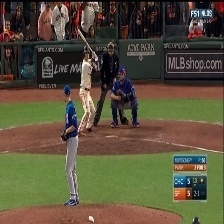
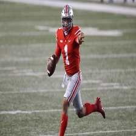
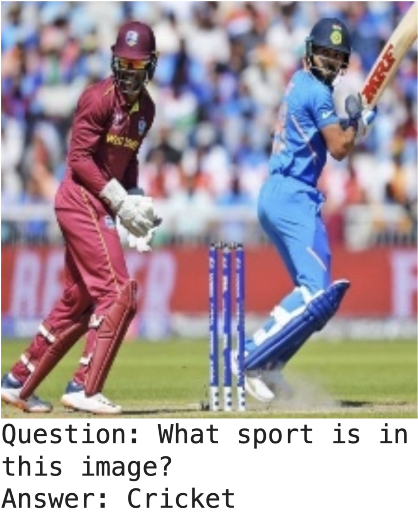
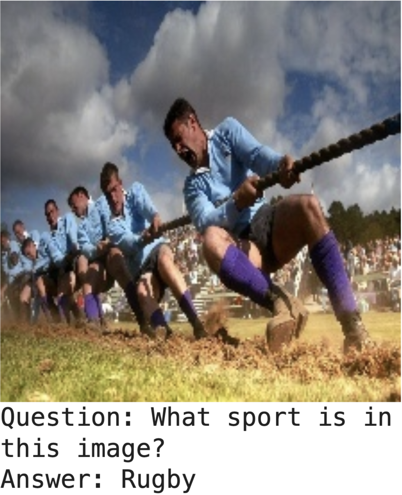

# Tutorial: Fine-Tuning Multimodal Image-to-Text LLMs

## Overview

Having discussed the theoretical underpinnings of MMLLMs in detail, we
can now test the behavior of a "Text+X" to "Text" model. For this
demonstration, we choose images to represent the the modality "X".
Image/text-to-image models are useful for detecting specific properties
of images, categorizing the events occurring in the images, and
generating automated captions, among other tasks. In this tutorial, we
test the out-of-the-box capabilities of a SOTA MMLLM on image labeling
and captioning and explore ways to improve performance with fine-tuning
and few-shot prompting.

We set up two experiments using a dataset of images from sporting events
to accomplish this goal.
First, we will ask the model to identify which sport is in each image,
both in a zero-shot framework and in a fine-tuned framework, and compare
the results. Second, we will ask the model to write simple captions of
what is occurring within the images, comparing zero-shot, few-shot, and
fine-tuning modes.

**Goals:**

-   Successfully set up and prompt the IDEFICS 9-billion parameter model
    with arbitrary text and images.

-   Generate zero-shot predictions for the 100SIC test set and try to
    improve performance with QLoRA fine-tuning.

-   Generate zero-shot captions for the 100SIC test set and compare them
    to fine-tuned and in-context learning captions.

## Experimental Design

There are many MMLLM to select from, so to narrow our choices we
consider models small enough to be QLoRA-tuned in a Google Colab
notebook and which are already integrated with Huggingface so that we
can easily take advantage of their PEFT and fine-tuning routines. With
these considerations, we choose as our model the 9 billion parameter
variant of IDEFICS (Image-aware Decoder Enhanced à la Flamingo with
Interleaved Cross-attentionS), an open-source text and image-to text LLM
modeled on Flamingo (<https://huggingface.co/HuggingFaceM4/idefics-9b>).
The model takes arbitrarily interleaved text and images as input and outputs
a textual response. It is built on top of Llama v1 and OpenCLIP, which are
used to embed text and encode images respectively, and was trained on the
OBELICS dataset of internet-scraped interleaved-text-and-image documents.

The dataset we choose for this experiment is the 100 Sports Image
Classification dataset (100SIC) hosted at Kaggle. This set includes
many small photos labeled by sport for 100 different sports. It consists
of approximately 13,000 training images and 500 test and validation
images. Two examples are shown in Fig. 1.

<p float="left">
  
   
</p>

*Figure 1: Two examples from the 100SIC dataset.*


## Predicting the Sport

We start by loading the model. IDEFICS is too large to predict with and
tune on a single moderate GPU effectively, so we will use BitsAndBytes
to quantize to 4-bit and fine-tune in the QLoRA paradigm.

    quant_config = BitsAndBytesConfig(
        load_in_4bit=True,
        bnb_4bit_quant_type="nf4",
        bnb_4bit_compute_dtype=torch.float16,
        bnb_4bit_use_double_quant=True,
        llm_int8_skip_modules=["lm_head", "embed_tokens"],
    )

    processor = AutoProcessor.from_pretrained("HuggingFaceM4/idefics-9b")

    model = IdeficsForVisionText2Text.from_pretrained(
        "HuggingFaceM4/idefics-9b",
        quantization_config=quant_config, device_map={"": 0}
    )

The processor object includes both the IDEFICS image processor based on
OpenCLIP, and the tokenizer based on Llama tokenization. The format for
creating prompts, passing them to the model, and decoding the output is
as follows:

    image = PIL.Image.open('./sports-classification/train/baseball/030.jpg')
    prompts = [
        <image>,
        <text>,
    ]

    inputs = processor(prompts, return_tensors="pt").to(device)
    generated_ids = model.generate(**inputs)
    generated_text = processor.batch_decode(generated_ids)[0]

The list `prompts` takes a series of image objects and text which
comprise the multimodal prompt. `<image>` can be either a `PIL.Image`
object or a URL pointing to an image, and `<text>` a string. The
processor encodes the images and the text and prepares them to be passed
to the model, which then generates an output that can be decoded. The
prompts list can take an arbitrary number of items, provided they do not
exceed the attention window.

For sport classification, we adopt the following prompt template:

``` {. language="" caption="Sport classification prompt"}
<image>
Question: What sport is in this image?
Answer:
```

\...and test the zero-shot performance of the model against two samples.

<p float="left">
  
   
</p>

*Figure 2: Inference on two more examples from the 100SIC dataset.*

In Fig. 2, the model does a good job of
replying with a sport, but only gets the first sample correct, misnaming
the second image rugby, when it is in fact tug-of-war. For a more
representative test, we predict in zero-shot mode against the entire 500
sample test set. For each output, we strip the response to just the
guessed sport, and compare against the provided label.

``` {. language="" caption="Zero-shot test set predictions"}
- Zero-shot results:
  - 212 / 500 correct
```

It thus guessed the correct name for the sport on approximately 42% of
the images. Note that we have done a simple exact-match evaluation, so
if the model guesses another acceptable name for a sport, it will be
considered a missed prediction.

We can improve our predictions by
fine-tuning the model with the training set. We convert our IDEFICS
model to a QLoRA-enhanced model, with adapter ranks = 16, alpha = 32,
and targeting the attention layers (q_proj, k_proj, v_proj). We select
for a training set 10 samples of each sport, and use the same template
as in the zero-shot example to create QA pairs for fine-tuning. We train
with these data for a single epoch, and again predict on the test set:

``` {caption="Fine-tune test set predictions"}
- Fine-tune results:
  - 419 / 500 correct
```


This shows major improvement, moving from 42% to 84% correct, a major
improvement. To understand where this improvement comes from, it is
instructive to look at samples where the zero-shot and fine-tuned
predictions differ. We have included three samples in Table 1,
showing the predictions of zero-shot and fine-tuned approaches on five
individual images in the test set.


<center>

|  **Index**  | **bobsled**     |  **bobsled** |     **chuckwagon racing**        |   **chuckwagon racing**  |                **tug of war** |**tug of war** |
|----------- |------------- |--------- |----------------------------- |-------------------| ----------------| -------------- |
|     |         ZS     |       FT   |     ZS         |                   FT        |          ZS       |        FT|
| 1 |  bobsledding |  bobsled  | rodeo            |             chuckwagon racing  | hurling |         oxen pulling|
|  2 |          the u    |     bobsled |  horse-drawn carriage racing |  chuckwagon racing |  rugby       |     tug of war|
|  3 |          bobsleigh  |   bobsled  | calgary stampede rodeo   |     chuckwagon racing |  tug of war   |    log rolling|
|  4 |          bobsledding |  bobsled |  horseback riding       |       chuckwagon racing  | tug of war   |    log rolling|
|  5 |          bobsled    |   bobsled  | chariot racing      |          chuckwagon racing  | tug of war  |     axe throwing|

*Table 1: Three cherry-picked examples demonstrating three themes of relative
  classification performance in increasing rareness in the zero-shot vs.
  fine-tuned approach. For bobsled, the zero-shot model correctly
  identifies the sport in most cases but does not know which name it
  should use. For chuckwagon racing, the model is unfamiliar with this
  obscure sport and guesses other types of equestrian competitions. For
  tug of war, fine-tuning has actually degraded the model's predictive
  power -- this would likely improve with additional fine-tuning.*
  
</center>

In some instances, such as bobsled,
the zero-shot model is correctly identifying the sport but has not
learned what name the training data calls it by. Fine-tuning reinforces
a consistent name across predictions. For others, such as chuckwagon
racing, it is not clear that the model has any information about this
rather obscure sport and instead guesses other sports involving horses.
Fine-tuning is able to teach the model about this sport. Finally, in
very rare instances such as tug-of-war, the fine-tuning procedure has
actually degraded the predictive performance. This is certainly an
artifact of the small dataset that we chose to fine-tune with, and
implies that additional model training optimization is worthwhile.

## Captioning Photos

A second common use of image-to-text models is generating automated
captions. In this section, we test the capabilities of IDEFICS for this
task. As before, we can use a simple zero-shot prompt template to query
the model to generate a caption. For this exercise, we use an image of a
Wake Forest quarterback in a black jersey throwing a pass in a game of
American football and the following prompt template:


*Figure 3: An example from the 100SIC dataset.*

``` {#code:sport_caption_prompt . language="" caption="Sport captioning prompt" label="code:sport_caption_prompt"}
<image>
Question: What is a caption for this photo?
Answer:
```

When using zero-shot prompting, we get the following response:

``` {#code:sport_caption_zs . language="" caption="Sport captioning zero-shot" label="code:sport_caption_zs"}
Question: What is a caption for this photo? Answer: Aaron Murray, Georgia
Bulldogs quarterback, throws a pass during the first half of the Chick-fil-A
Bowl NCAA college football game against the Nebraska Cornhuskers
```

While this is a quarterback throwing a pass, every other piece of
information in this response is false. It is not Aaron Murray nor a
Georgia Bulldog, and this is not the Chick-fil-A bowl nor a game against
Nebraska. All of this information was hallucinated, but notably the
final two false facts are not even items that could be determined based
on the image alone. Ideally we would like our captions to be
straightforward descriptions of the image, downplaying specific
identifying information that is not plainly visible in the photograph.

An inexpensive way to improve the model captioning is with in-context
examples. For this approach, we pass several examples of training images
along with hand-written captions before the target image that we are
generating for. With this approach, we get the following template.

```
<image1> Question: What is a caption for this photo?
Answer: A man prepares to throw an ax at a target.

<image2> Question: What is a caption for this photo?
Answer: A woman rolls a bowling ball down a bowling alley.

<image3> Question: What is a caption for this photo?
Answer: Several competitors jump over hurdles during a race.

<image4> Question: What is a caption for this photo?
Answer: A man in a red jersey tackles a man carrying a rugby ball in a blue jersey.

<image> Question: What is a caption for this photo?
Answer:
```

Each caption corresponds to the image presented immediately before the
start of the prompt. Returning to the base IDEFICS model and using this
prompt template along with Fig. 3, we now get the following output:

``` {. language="" caption="Sport captioning in-context prompt"}
<image1> Question: What is a caption for this photo? Answer: A man prepares to throw an ax at a target. 
<image2> Question: What is a caption for this photo? Answer: A woman rolls a bowling ball down a bowling alley. 
... 
<image5> Question: What is a caption for this photo? Answer:
A man in a white jersey throws a football.
```

Under few-shot conditions, the model has generated
"`A man in a white jersey throws a football.`" This is a slight mistake
as the jersey color is black, but the model has formatted the caption
according to our preferences and not hallucinated extraneous information
like the identity of the player or their opponent. This is a promising
avenue with some improvements.

A more expensive approach is to fine-tune the model with a training set
of image/caption pairs pertinent to the domain we are considering. To do
this, we supplement this dataset with a subset of the flickr30k dataset,
a 30,000+ item catalog of image and caption pairs. We used a subset of
flickr30k images identified as sports. The descriptions are terse and
straight-forward, for example:
"`There are two boys on a basketball court and one is holding a basketball.`"

Using this supplmenetary dataset, we emply the same QLoRA approach
described above and fine-tune the base IDEFICS model with roughly 1600
samples using the same template from the zero-shot example. Once the
training is complete, we can generate a caption for our test figure
again.

``` {. language="" caption="Sport captioning fine-tuning output"}
A football player in a black uniform is throwing a football.
```

This response is both concise, similar to the few-shot response, and
accurate to the photo. We generate captions for twenty test images using
all three approaches as a final comparison, and qualitatively grade the
responses by hand, considering both accuracy and style. The final
results are:

``` {caption="Test set captioning results"}
- Zero-shot results:
  - 7 / 20 acceptable
- In-context results:
  - 11 / 20 acceptable
- Fine-tuning results:
  - 14 / 20 acceptable
```

## Conclusion

Moderately sized text/image-to-text MMLLMs show considerable zero-shot
capabilities but are greatly improved with fit-to-task fine-tuning. We
have shown how utilizing PEFT can greatly improve image classification
and open-ended captioning capabilities, even with little optimization
and standard parameter choices. Production applications would clearly
benefit from additional care in selecting tuning parameters, training
set properties, and the MMLLM architecture itself, but only a small
amount of effort is required to create a moderately well-functioning
image classifier from available open-source software.

[^1]: <https://www.kaggle.com/datasets/gpiosenka/sports-classification/data>

[^2]: <https://github.com/ShinThant3010/Captioning-on-Sport-Images>
